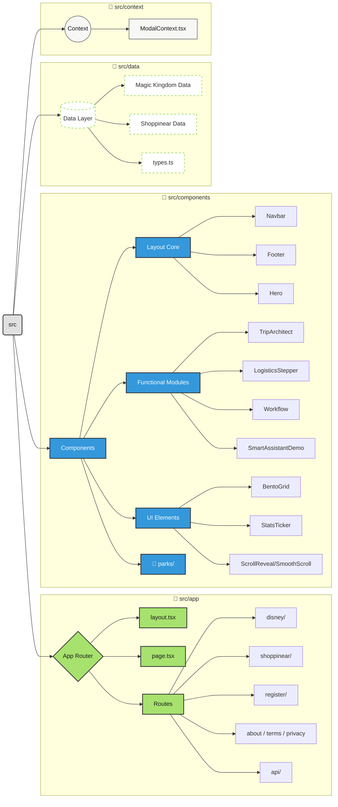

```mermaid
graph LR
    %% Estilos O247
    classDef base fill:#f7f7f5,stroke:#333,stroke-width:1px,color:#1a1a1a;
    classDef base fill:#f7f7f5,stroke:#333,stroke-width:1px,color:#1a1a1a;
    classDef folder fill:#e0e0e0,stroke:#333,stroke-width:2px,color:#1a1a1a;
    classDef app fill:#a7e26e,stroke:#333,stroke-width:2px,color:#1a1a1a;
    classDef comp fill:#3498db,stroke:#333,stroke-width:2px,color:#fff;
    classDef data fill:#fff,stroke:#a7e26e,stroke-width:2px,stroke-dasharray: 5 5;

    SRC(src) --> APP{App Router}
    SRC --> COMPS[Components]
    SRC --> DATA[(Data Layer)]
    SRC --> CTX((Context))

    %% APP STRUCTURE
    subgraph Application ["📂 src/app"]
        APP --> Layout[layout.tsx]
        APP --> Page[page.tsx]
        APP --> Routes
        
        Routes --> R_Disney[disney/]
        Routes --> R_Shop[shoppinear/]
        Routes --> R_Reg[register/]
        Routes --> R_Info[about / terms / privacy]
        Routes --> R_Api[api/]
    end

    %% COMPONENT STRUCTURE
    subgraph Components ["📂 src/components"]
        COMPS --> Core[Layout Core]
        Core --> Navbar
        Core --> Footer
        Core --> Hero
        
        COMPS --> Func[Functional Modules]
        Func --> TripArch[TripArchitect]
        Func --> Logistics[LogisticsStepper]
        Func --> Work[Workflow]
        Func --> SmartAI[SmartAssistantDemo]
        
        COMPS --> UI[UI Elements]
        UI --> Bento[BentoGrid]
        UI --> Stats[StatsTicker]
        UI --> Scroll[ScrollReveal/SmoothScroll]
        
        COMPS --> CParks[📂 parks/]
    end

    %% DATA LAYER
    subgraph Data ["📂 src/data"]
        DATA --> MK[Magic Kingdom Data]
        DATA --> ShopData[Shoppinear Data]
        DATA --> Types[types.ts]
    end

    %% CONTEXT
    subgraph Context ["📂 src/context"]
        CTX --> Modal[ModalContext.tsx]
    end

    %% CLASES
    class SRC folder;
    class APP,Layout,Page,Routes app;
    class COMPS,Core,Func,UI,CParks comp;
    class DATA,MK,ShopData,Types data;
    class CTX,Modal base;

    class CTX,Modal base;
```